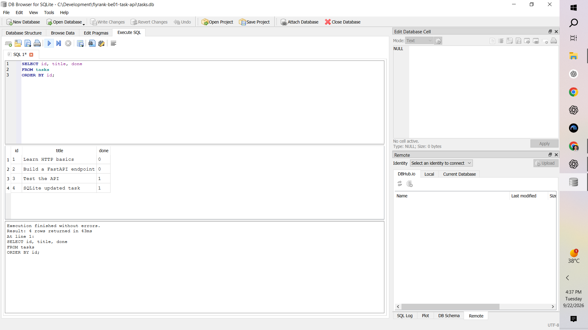
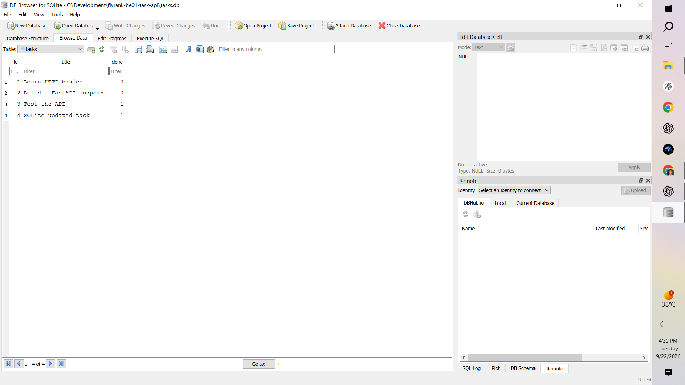
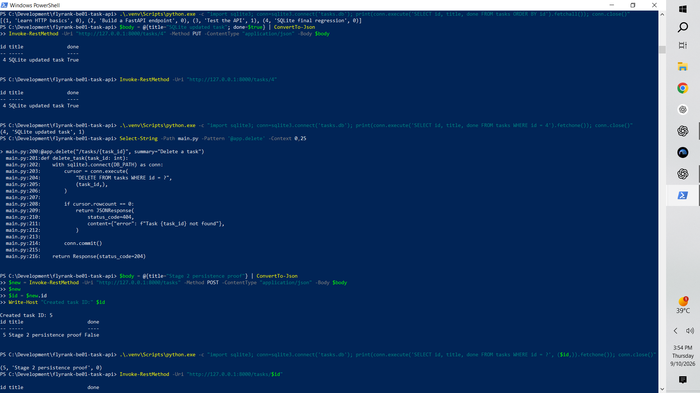
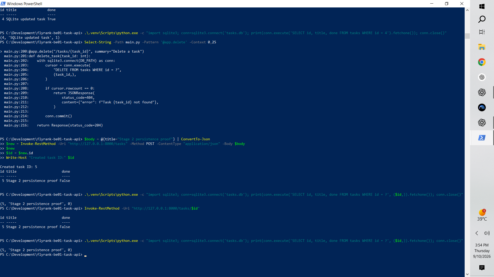
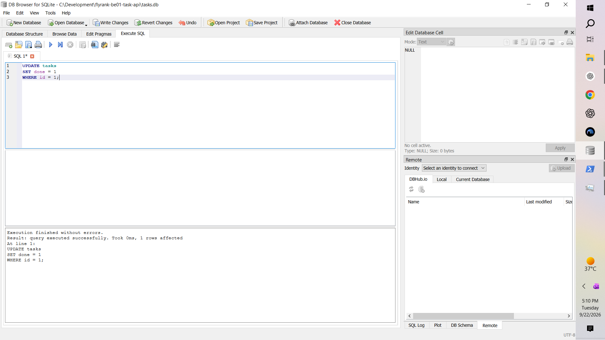
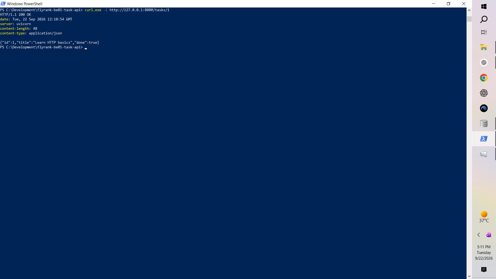

# FastAPI Task CRUD API — SQLite Persistence

A small REST API built for the **FlyRank Backend Engineering Internship**.

This project started as an in-memory CRUD API in Assignment 1 and was migrated to **SQLite** for Week 3 Assignment A2. The external API contract stays the same while the storage layer now persists tasks to disk.

## What the API Does

The API supports the four core CRUD operations:

- Create tasks
- Read all tasks or one task by ID
- Update a task
- Delete a task

It also demonstrates:

- HTTP status codes
- JSON request and response bodies
- Input validation
- FastAPI / Swagger UI
- SQLite persistence
- Parameterized SQL queries
- Manual SQL inspection with DB Browser for SQLite
- Git-based incremental development

## Tech Stack

- Python 3.10+
- FastAPI
- Uvicorn
- SQLite
- Python built-in `sqlite3` module
- Swagger UI / OpenAPI
- DB Browser for SQLite
- Git and GitHub

## Project Structure

```text
flyrank-be01-task-api/
├── docs/
│   ├── swagger-ui.png
│   └── evidence/
│       └── week3-sqlite/
│           ├── 01_DB_Schema_Tasks_Table.png
│           ├── 02_DB_Browse_Data_Current_Rows.png
│           ├── 03_SQL_Select_Query_Results.png
│           ├── 04_API_Persistence_Before_Restart.png
│           ├── 05_API_Persistence_After_Restart.png
│           ├── 06_SQL_Update_Done_True.png
│           ├── 07_API_Reflects_SQL_Update_True.png
│           ├── 08_SQL_Update_Done_False.png
│           ├── 09_API_Reflects_SQL_Update_False.png
│           ├── 10_SQLite_CRUD_Cycle_Proof.png
│           └── 11_Git_SQLite_CRUD_Commit_and_Push.png
├── .gitignore
├── main.py
├── requirements.txt
└── README.md
```

`tasks.db` is created automatically when the application starts and is intentionally ignored by Git so each clone can create its own local database.

## Why SQLite

SQLite was chosen because it is a good fit for a small learning backend:

- It stores the database in a single local file.
- It requires no separate database server.
- Python can use it through the built-in `sqlite3` module.
- Data survives application restarts.
- It keeps the project simple while still demonstrating real persistent SQL storage.

The database file is:

```text
tasks.db
```

The application creates it automatically if it does not exist.

## Database Schema

The application creates the `tasks` table automatically:

```sql
CREATE TABLE IF NOT EXISTS tasks (
    id INTEGER PRIMARY KEY,
    title TEXT NOT NULL,
    done INTEGER NOT NULL DEFAULT 0
);
```

The `done` value is stored as an SQLite integer (`0` or `1`) and returned through the API as a JSON boolean (`false` or `true`).

## Automatic Seed Data

If the database is empty, the application inserts three example tasks:

```text
1. Learn HTTP basics
2. Build a FastAPI endpoint
3. Test the API
```

The seed runs only when the table is empty, so restarting the server does not keep adding duplicate seed rows.

## Installation

Clone the repository and enter the project directory:

```powershell
git clone https://github.com/mohammadusamashaikh9-cmd/flyrank-be01-task-api.git
cd flyrank-be01-task-api
```

Create a virtual environment:

```powershell
python -m venv .venv
```

Install the dependencies:

```powershell
.\.venv\Scripts\python.exe -m pip install -r requirements.txt
```

## Run the API

Start the server with:

```powershell
.\.venv\Scripts\python.exe -m uvicorn main:app --reload
```

The API runs at:

```text
http://127.0.0.1:8000
```

Swagger UI is available at:

```text
http://127.0.0.1:8000/docs
```

No manual database setup is required. On startup, the application creates `tasks.db`, creates the `tasks` table if needed, and seeds the three example tasks when the table is empty.

## API Endpoints

| Method | Endpoint | Purpose | Success status |
|---|---|---|---|
| GET | `/` | API information | 200 |
| GET | `/health` | Health check | 200 |
| GET | `/tasks` | List all tasks | 200 |
| GET | `/tasks/{task_id}` | Get one task | 200 |
| POST | `/tasks` | Create a task | 201 |
| PUT | `/tasks/{task_id}` | Update a task | 200 |
| DELETE | `/tasks/{task_id}` | Delete a task | 204 |

Unknown task IDs return `404 Not Found`.

Invalid POST or PUT bodies return `400 Bad Request`.

Error responses use JSON, for example:

```json
{
  "error": "Task 99 not found"
}
```

## Example Task

```json
{
  "id": 1,
  "title": "Learn HTTP basics",
  "done": false
}
```

## Example Create Request

```json
{
  "title": "Buy milk"
}
```

A successful POST creates a new database row, returns `201 Created`, and defaults `done` to `false`.

## Example Update Request

```json
{
  "title": "Updated task",
  "done": true
}
```

A successful PUT updates the same row in SQLite and returns the updated task.

## Parameterized SQL

CRUD operations use SQLite placeholders instead of inserting user input directly into SQL strings.

Example:

```python
row = conn.execute(
    "SELECT id, title, done FROM tasks WHERE id = ?",
    (task_id,),
).fetchone()
```

The same pattern is used for inserts, updates, and deletes.

## Stage 4 — SQL Query Run by Hand

One SQL query executed directly in DB Browser for SQLite was:

```sql
SELECT id, title, done
FROM tasks
ORDER BY id;
```

It returned the task rows currently stored in the same `tasks.db` file used by the FastAPI application.



## Database Browser Evidence

The same SQLite rows can be inspected directly in DB Browser for SQLite:



This confirms that the API is backed by SQLite rather than an in-memory Python list.

## Persistence Verification

Persistence was tested by reading task data through the API, restarting the server, and reading the data again.

Before restart:



After restart:



The task data remained available after the restart because it was stored in `tasks.db`.

## One Source of Truth

The database was also changed directly with SQL in DB Browser and then read again through the API.

For example, the `done` value for a task was updated in SQLite and the API reflected the same change without needing a separate synchronization step.

SQL update evidence:



API reflection evidence:



This demonstrates that DB Browser and the FastAPI routes operate on the same database file.

## CRUD Verification

The SQLite-backed API was tested for the full CRUD cycle:

- `POST /tasks` creates a persistent database row and returns `201 Created`.
- `GET /tasks` and `GET /tasks/{task_id}` read from SQLite and return `200 OK`.
- `PUT /tasks/{task_id}` updates the database row and returns `200 OK`.
- `DELETE /tasks/{task_id}` removes the row and returns `204 No Content`.
- Unknown IDs return `404 Not Found`.
- Invalid request bodies return `400 Bad Request`.

Supporting runtime evidence is stored in:

```text
docs/evidence/week3-sqlite/
```

## Why the API Contract Did Not Need to Change

Assignment 1 used an in-memory Python list. This assignment replaces that storage layer with SQLite while keeping the client-facing endpoints and expected status codes the same.

The same endpoint behavior was re-tested after the migration. Passing the same API checks against the SQLite version shows that storage is an implementation detail behind the API contract: clients still send the same requests and receive the same response shapes even though the data is now stored on disk.

## Swagger UI

FastAPI generates interactive API documentation at `/docs`.


## Clean-Start Behavior

A fresh clone does not need a committed database file.

Because `tasks.db` is listed in `.gitignore`, a clean clone starts without the local database. When the application is started:

1. SQLite creates `tasks.db`.
2. `init_db()` creates the `tasks` table if it is missing.
3. The application checks whether the table is empty.
4. Three example tasks are inserted only when the table has no rows.
5. The API is immediately ready to use.

## Development Evidence

The Week 3 migration was developed incrementally and verified through Git commits, runtime API checks, direct SQLite inspection, and saved screenshots.

The evidence pack is located at:

```text
docs/evidence/week3-sqlite/
```

The repository history records the SQLite initialization, seed correction, database read migration, persistent CRUD migration, SQLite verification evidence, and final documentation work.

## What I Practiced

- Moving backend storage from memory to SQLite
- Creating a database and table automatically
- Seeding initial data safely
- Reading rows with SQL
- Inserting, updating, and deleting rows
- Parameterized SQL placeholders
- Mapping SQLite integer values to JSON booleans
- Persistence across application restarts
- Inspecting data with DB Browser for SQLite
- Running SQL manually
- Verifying API and database state against the same source of truth
- Preserving an existing API contract while changing its storage implementation
- Documenting backend evidence in GitHub
