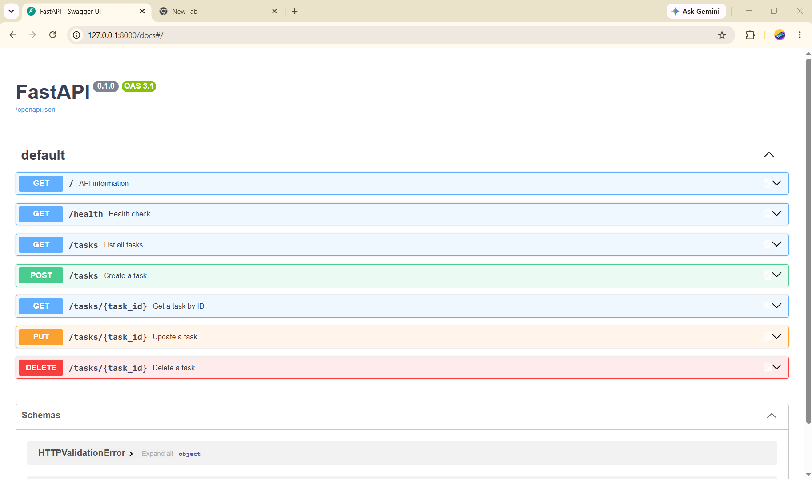

# FastAPI Task CRUD API

A small REST API built for the FlyRank Backend Engineering internship assignment.

The API manages an in-memory to-do list and demonstrates the four core CRUD operations:

- Create tasks
- Read tasks
- Update tasks
- Delete tasks

The project also demonstrates HTTP status codes, request validation, Swagger UI, curl testing, and Git stage-by-stage development.

## Tech Stack

- Python 3.10+
- FastAPI
- Uvicorn
- In-memory Python list
- Swagger UI / OpenAPI
- Git and GitHub

## Project Structure

```text
flyrank-be01-task-api/
├── docs/
│   └── swagger-ui.png
├── .gitignore
├── main.py
├── requirements.txt
└── README.md
```

## Installation

Clone the repository and enter the project directory.

Create a virtual environment:

```powershell
python -m venv .venv
```

Install the dependencies:

```powershell
.\.venv\Scripts\python.exe -m pip install -r requirements.txt
```

## Run the API

Start the server with:

```powershell
.\.venv\Scripts\python.exe -m uvicorn main:app --reload
```

The API will run at:

```text
http://127.0.0.1:8000
```

Swagger UI is available at:

```text
http://127.0.0.1:8000/docs
```

## API Endpoints

| Method | Endpoint | Purpose | Success status |
|---|---|---|---|
| GET | `/` | API information | 200 |
| GET | `/health` | Health check | 200 |
| GET | `/tasks` | List all tasks | 200 |
| GET | `/tasks/{task_id}` | Get one task | 200 |
| POST | `/tasks` | Create a task | 201 |
| PUT | `/tasks/{task_id}` | Update a task | 200 |
| DELETE | `/tasks/{task_id}` | Delete a task | 204 |

Unknown task IDs return `404 Not Found`.

Invalid POST or PUT bodies return `400 Bad Request`.

## Example Task

```json
{
  "id": 1,
  "title": "Learn HTTP basics",
  "done": false
}
```

## Example Create Request

```json
{
  "title": "Buy milk"
}
```

A successfully created task receives the next available ID and defaults to:

```json
{
  "done": false
}
```

## Verified curl Output

The following output was observed while testing the running API:

```text
curl.exe -i http://127.0.0.1:8000/tasks/1

HTTP/1.1 200 OK
server: uvicorn
content-length: 49
content-type: application/json

{"id":1,"title":"Learn HTTP basics","done":false}
```

The CRUD flow was also tested with `curl -i`, including:

- `201 Created` for task creation
- `200 OK` for reads and updates
- `204 No Content` for deletion
- `400 Bad Request` for invalid bodies
- `404 Not Found` for unknown task IDs

## Swagger UI

FastAPI automatically generates interactive API documentation at `/docs`.

The complete CRUD cycle was tested through Swagger UI using **Try it out**.



## Storage and Limitations

This assignment intentionally uses an **in-memory Python list** rather than a database or file storage.

Tasks created while the server is running are lost when the application restarts. This is expected for this learning assignment and demonstrates why persistent database storage is needed in production applications.

## Development Evidence

The project was built and verified stage by stage with separate Git commits:

1. Stage 0: hello server
2. Stage 1: root and health endpoints
3. Stage 2: read endpoints with 404
4. Stage 3: create with validation
5. Stage 4: full CRUD
6. Stage 5: Swagger UI

## What I Practiced

- HTTP request/response behavior
- REST-style CRUD endpoints
- HTTP status codes
- JSON request and response bodies
- Path parameters
- Input validation
- In-memory application state
- Swagger/OpenAPI documentation
- curl-based API testing
- Git-based incremental development